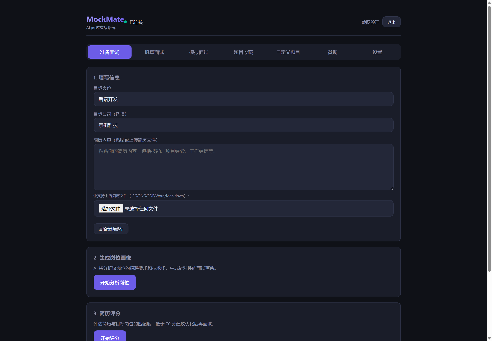
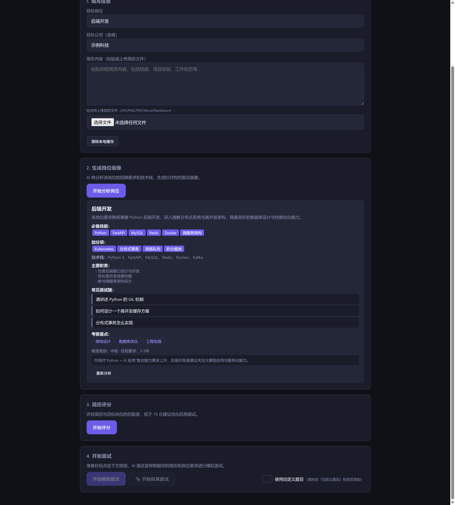
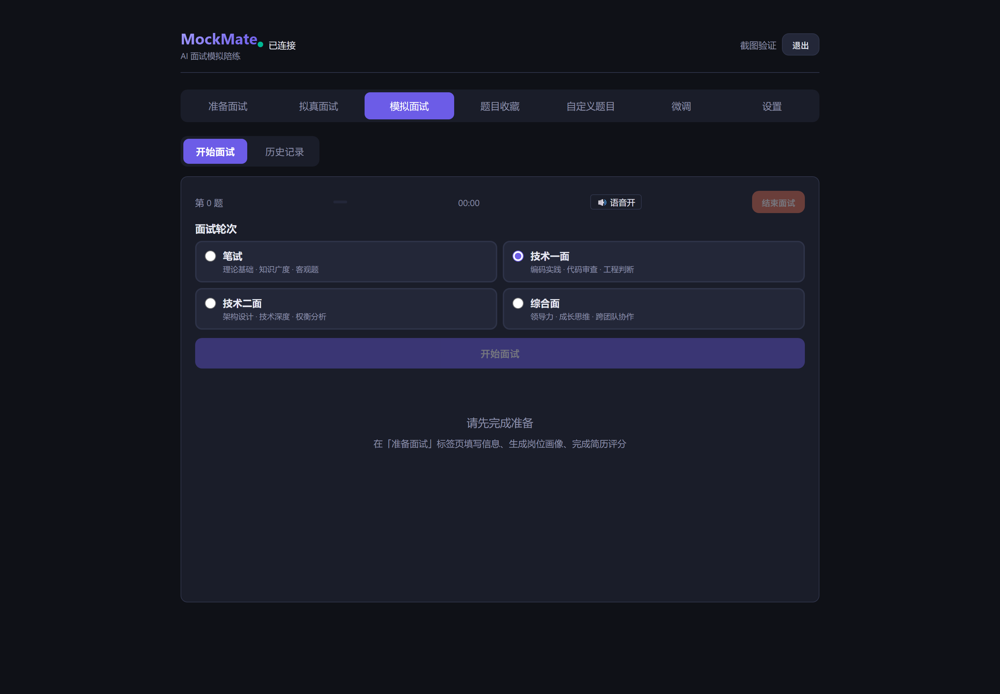
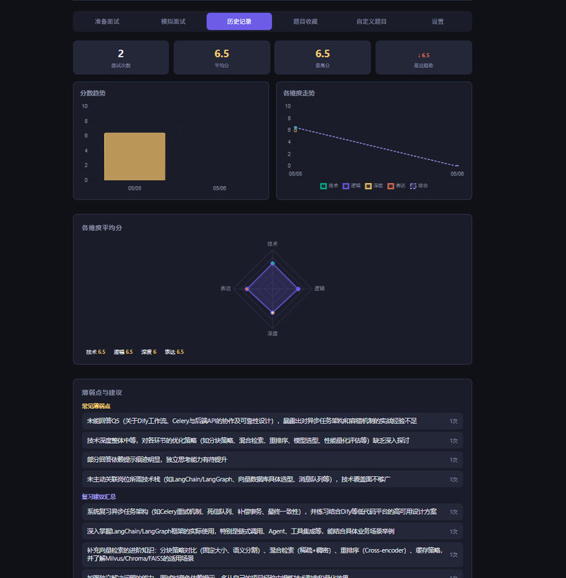
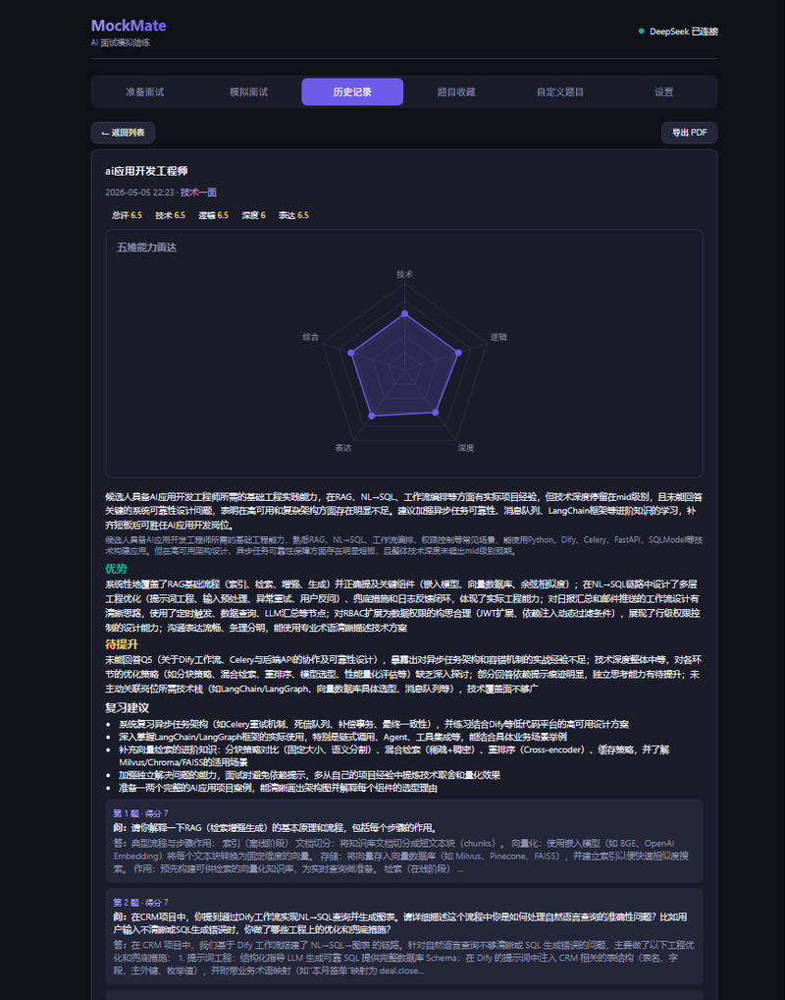

# MockMate — AI 面试模拟陪练

一款基于 FastAPI 的 AI 面试模拟工具。输入简历和目标岗位，AI 面试官出题、评分、生成报告，支持**拟真多面试官面试**、语音问答、断点续面、自定义题目、题目收藏等。

---

## 界面预览

**准备面试** — 填写简历、选择面试轮次、生成岗位画像



**岗位画像分析** — AI 搜索岗位招聘要求，生成结构化画像



**模拟面试** — AI 面试官出题，支持语音、倒计时、提示



**历史记录** — 多维度趋势图表、薄弱点分析



**历史记录详情** — 雷达图评分、逐题回顾



---

## 快速开始

### 安装依赖

```bash
cd MockMate
pip install -r requirements.txt
```

### 配置 API Key

MockMate 支持四个 AI 提供商（可在网页端运行时切换）：

| 提供商 | 支持能力 | 申请地址 |
|--------|---------|---------|
| **MiMo**（小米） | 推理出题、简历图片识别、语音合成 | [https://100t.xiaomimimo.com](https://100t.xiaomimimo.com) |
| **DeepSeek** | 推理出题、对话（不支持图片和语音） | [https://platform.deepseek.com](https://platform.deepseek.com) |
| **通义千问 (Qwen)** | 推理出题、对话、图片识别（vl）、语音合成（CosyVoice） | [https://help.aliyun.com/zh/model-studio](https://help.aliyun.com/zh/model-studio) |
| **智谱 (Zhipu)** | 推理出题、对话（GLM-4 系列） | [https://open.bigmodel.cn](https://open.bigmodel.cn) |

配置方式（二选一）：

**方式一：环境变量**
```bash
set MIMO_API_KEY=your_key_here
set DEEPSEEK_API_KEY=your_key_here
set AI_PROVIDER=mimo    # 或 deepseek / qwen / zhipu
```

**方式二：启动后网页配置**
启动服务后，在浏览器打开设置页面，填入 API Key 并保存。

### 启动

```bash
start.bat        # Windows 双击 或
python run.py    # 直接运行
```

浏览器打开 http://127.0.0.1:18633

> **HTTPS 支持**：启动后会自动生成自签名 SSL 证书，局域网其他设备可通过 `https://<LAN-IP>:18633` 访问并使用麦克风（首次访问需信任自签名证书）。

---

## 架构

```
┌─────────┐     ┌─────────────────────────────────────────────────┐     ┌───────────┐
│ 浏览器   │────▶│                FastAPI 服务                       │────▶│  MiMo API │
│ (SPA)   │     │                                                 │     │  DeepSeek │
└─────────┘     │  ┌─────────────────────────────────────────────┐│     │  Qwen API │
                │  │              安全层 (Security Pipeline)      ││     │  Zhipu API│
                │  │  InputGuard → OutputGuard → StateVerifier    ││     └───────────┘
                │  └─────────────────────────────────────────────┘│
                │       │                        │                │
                │       ▼                        ▼                │
                │  ┌──────────┐  ┌──────────────────────────────┐ │
                │  │ 路由层    │  │    拟真面试引擎               │ │
                │  │ main.py  │  │  mock_engine                  │ │
                │  └────┬─────┘  │  mock_state                   │ │
                │       │        │  api_router                   │ │
                │       │        │  interviewer_config            │ │
                │       ▼        └──────────────────────────────┘ │
                │  ┌──────────┐               │                   │
                │  │ 网页搜索   │               ▼                   │
                │  │web_resea │  ┌──────────────────────────────┐ │
                │  │ rch.py   │  │   统一 AI 客户端              │ │
                │  └──────────┘  │  ai_client                   │ │
                │       │        │  ┌─────┐ ┌──────┐ ┌──────┐  │ │
                │       ▼        │  │MiMo │ │Deep  │ │Qwen  │  │─│─▶ HTTP API
                │  ┌──────────┐  │  │Cli  │ │Seek  │ │Cli   │  │ │
                │  │ 数据库    │  │  └─────┘ └──────┘ └──────┘  │ │
                │  │database │  │  ┌──────┐ ┌─────────────────┐ │ │
                │  │ .py     │  │  │Zhipu │ │   语音合成 TTS   │ │ │
                │  └──────────┘  │  │Cli   │ │  tts.py         │ │ │
                │       │        │  └──────┘ │  cosyvoice_ws   │ │ │
                │       ▼        └───────────┴─────────────────┘ │
                │  ┌──────────┐                                   │
                │  │ finetune │                                   │
                │  │ 训练数据   │                                   │
                │  └──────────┘                                   │
                └─────────────────────────────────────────────────┘
```

### 核心模块

| 模块 | 文件 | 职责 |
|------|------|------|
| **入口** | `run.py` | 启动入口 |
| **Web 服务** | `backend/main.py` | FastAPI 应用，路由注册，全局实例管理 |
| **AI 客户端** | `backend/ai_client.py` | 统一接口，四提供商自动路由和 fallback |
| **MiMo 客户端** | `backend/mimoclient.py` | 小米 MiMo API 封装（推理、多模态、TTS） |
| **DeepSeek 客户端** | `backend/deepseek_client.py` | DeepSeek API 封装（推理、对话） |
| **Qwen 客户端** | `backend/qwen_client.py` | 通义千问 API 封装（推理、对话、多模态、TTS） |
| **智谱客户端** | `backend/zhipu_client.py` | 智谱 GLM-4 API 封装（推理、对话） |
| **传统面试引擎** | `backend/interview_engine.py` | 旧版出题、评分、报告生成的 Prompt 编排 |
| **拟真面试引擎** | `backend/mock_interview/mock_engine.py` | 多面试官拟真面试核心引擎（流式出题、追问、质量驱动阶段推进） |
| **拟真面试状态** | `backend/mock_interview/mock_state.py` | 面试状态管理、面试官路由评分、阶段推进决策 |
| **拟真面试路由** | `backend/mock_interview/api_router.py` | 拟真面试 API 编排（创建、答题、历史管理） |
| **面试官配置** | `backend/mock_interview/interviewer_config.py` | 面试官角色创建、Prompt 生成、行为属性建模 |
| **安全层** | `backend/mock_interview/security.py` | 5 层安全防御体系（注入检测、输出扫描、状态校验等） |
| **WebSocket 流式聊天** | `backend/stream_chat.py` | AI 流式聊天 WebSocket 通信 |
| **CosyVoice WebSocket** | `backend/cosyvoice_ws.py` | 阿里云 CosyVoice TTS WebSocket 长文本合成 |
| **网页搜索** | `backend/web_research.py` | 多引擎并行搜索 + AI 整合成岗位画像 |
| **语音合成** | `backend/tts.py` | 文字转语音 WAV |
| **数据持久化** | `backend/database.py` | MySQL / JSON 文件双模式存储（会话、缓存、搜索历史） |
| **配置** | `backend/config.py` | 环境变量和常量配置 |
| **训练数据** | `backend/finetune/` | 训练数据采集、管理、LoRA 微调准备 |
| **前端** | `frontend/` | 模块化 SPA（12 个 JS 模块 + 独立 CSS） |

---

## 安全架构

```
┌──────────────────────────────────────────────────────────────┐
│                   Security Pipeline                            │
│                                                              │
│  ┌──────────┐   ┌──────────┐   ┌──────────┐   ┌──────────┐  │
│  │InputGuard │──▶│OutputGuard│──▶│StateVeri │──▶│MemoryGuard│  │
│  │ 注入检测   │   │ 泄漏扫描  │   │ 状态机校验 │   │ 记忆污染  │  │
│  └──────────┘   └──────────┘   └──────────┘   └──────────┘  │
│       │              │              │              │         │
│       ▼              ▼              ▼              ▼         │
│  8 种攻击类型    5 类关键词      状态转移矩阵     上下文污染    │
│  加权正则匹配     分级告警       非法操作拦截     自动隔离     │
└──────────────────────────────────────────────────────────────┘
```

拟真面试系统内置 5 层安全防御，覆盖 8 种攻击类型：

| 安全层 | 职责 | 防护目标 |
|--------|------|---------|
| **InputGuard** | 用户输入注入检测 | Prompt 注入、越狱、角色逃逸、权限提升 |
| **Prompt Isolation** | 系统提示与用户数据隔离 | 数据污染、交叉会话干扰 |
| **OutputGuard** | AI 输出关键词扫描 | 系统提示泄漏、敏感信息泄露 |
| **StateVerifier** | 状态机转移校验 | 越权操作、状态异常跳转 |
| **MemoryGuard** | 上下文记忆污染检测 | 长期记忆投毒、历史篡改 |

### 攻击检测分类

| 攻击类型 | 说明 | 检测方式 |
|---------|------|---------|
| `prompt_injection` | 提示词注入 | 加权正则 + 关键字评分 |
| `jailbreak` | 越狱攻击 | 越狱模板识别 |
| `role_escape` | 角色逃逸 | 系统角色欺骗检测 |
| `system_leak` | 系统提示泄漏 | Prompt 模板指纹匹配 |
| `privilege_escalation` | 权限提升 | 特权操作请求检测 |
| `memory_pollution` | 记忆污染 | 交叉上下文污染检测 |
| `tool_abuse` | 工具滥用 | 调用频率和参数异常 |
| `data_exfiltration` | 数据窃取 | 批量数据请求检测 |

### 核心原则

1. **LLM 只负责生成语言**，不负责任何系统控制决策
2. **用户输入永远不能直接影响系统控制逻辑**
3. **多层防御**，不依赖单层 Prompt 安全
4. 所有安全事件记录详细日志，支持审计追踪

---

## API 文档

所有接口前缀 `/api`，请求/响应均为 JSON。

### 基础

#### `GET /api/status`
服务状态和配置信息。

```json
{
  "status": "ok",
  "provider": "mimo",
  "mimo_ready": false,
  "deepseek_ready": false,
  "qwen_ready": false,
  "zhipu_ready": false,
  "db": "json",
  "cache": { "total": 0, "valid": 0, "expired": 0 }
}
```

#### `POST /api/config`
更新 API Key 或切换提供商。

```json
{ "mimo_api_key": "sk-xxx", "deepseek_api_key": "sk-xxx", "provider": "deepseek" }
```

### 简历

#### `POST /api/resume/parse`
上传简历文件进行解析（JPG/PNG/PDF/DOCX/MD）。

#### `POST /api/resume/analyze`
AI 分析简历文本，提取技能、经验、项目。

### 岗位研究

#### `POST /api/research`
全网搜索目标岗位的招聘要求和面经，生成结构化岗位画像。结果缓存 90 天。

### 传统面试

#### `POST /api/interview/start`
开始一场传统面试。支持选择面试轮次，**每个轮次有独立的面试官角色定位和考察方向**。

| 轮次 | 值 | 面试官角色 | 考察方向 |
|------|-----|-----------|---------|
| 笔试 | `written` | 笔试考官 | 理论基础与知识广度（客观题） |
| 技术一面 | `tech_1` | 资深工程师 | 工程实践与编码能力 |
| 技术二面 | `tech_2` | 架构师/技术总监 | 架构设计与技术深度 |
| 综合面 | `comprehensive` | 工程 VP/HR 负责人 | 综合素质与发展潜力 |
| 自定义练习 | `custom` | — | 使用自定义题目练习 |

#### `POST /api/interview/answer`
提交回答，获取评分和下一题（5 维度评分 + 参考回答）。

#### `POST /api/interview/end`
结束面试，生成总结报告。

### 拟真面试（多面试官）

拟真面试是 MockMate 的旗舰功能 — 多个 AI 面试官依次上场，自动推进 9 个面试阶段，支持追问、切换、质量驱动的阶段推进。

#### 面试官管理

| 方法 | 路径 | 说明 |
|------|------|------|
| POST | `/api/mock/interviewers` | 创建面试官角色 |
| GET | `/api/mock/interviewers` | 列出所有面试官 |
| GET | `/api/mock/interviewers/{id}` | 获取单个面试官 |
| PUT | `/api/mock/interviewers/{id}` | 更新面试官配置 |
| DELETE | `/api/mock/interviewers/{id}` | 删除面试官 |

```json
// POST /api/mock/interviewers 请求
{
  "name": "张工",
  "role": "资深后端工程师",
  "style": "严谨专业，喜欢追问细节",
  "focus_area": "分布式系统、数据库、高并发",
  "aggressiveness": 0.7,
  "follow_up_depth": 0.8,
  "interruption_rate": 0.3,
  "voice_style": "稳重男声",
  "preferred_stages": ["general_tech", "deep_dive", "project"]
}
```

**面试官行为属性**：

| 属性 | 范围 | 说明 |
|------|------|------|
| `aggressiveness` | 0~1 | 攻击性：越高越倾向挑战、质疑、施压 |
| `follow_up_depth` | 0~1 | 追问深度：越高越倾向连续深挖不换人 |
| `interruption_rate` | 0~1 | 打断概率：越高越倾向插话抢问 |
| `preferred_stages` | 列表 | 偏好的面试阶段 |

#### 创建拟真面试

##### `POST /api/mock/interview/start`

```json
// 请求
{
  "interviewer_ids": ["id1", "id2", "id3"],
  "resume": "简历内容...",
  "profile": {},
  "max_duration": 3600,
  "wrap_up_threshold": 0.8
}
```

| 参数 | 说明 |
|------|------|
| `interviewer_ids` | 参加的面试官 ID 列表（至少 2 位） |
| `max_duration` | 最大时长（秒），默认 3600 |
| `wrap_up_threshold` | 收尾阈值（0~1），达到此进度时开始收尾 |

```json
// 响应
{
  "session_id": "a1b2c3d4e5f6",
  "interviewers": [
    { "id": "id1", "name": "张工", "role": "资深后端工程师", ... },
    { "id": "id2", "name": "李总", "role": "技术总监", ... }
  ],
  "stages": ["intro", "resume", "general_tech", "deep_dive", "project", "pressure", "hr", "qna", "end"],
  "current_stage": "intro",
  "current_interviewer": { "id": "id1", "name": "张工", ... }
}
```

#### WebSocket 流式面试

##### `WebSocket /api/mock/interview/ws/{session_id}`

拟真面试采用 WebSocket 全双工通信，消息均为 JSON。

**发往服务器**：

```json
// 提交回答
{
  "type": "answer",
  "answer": "我的回答是...",
  "elapsed": 120
}
```

| 字段 | 说明 |
|------|------|
| `answer` | 用户回答文本 |
| `elapsed` | 本题已用时（秒） |

**来自服务器**：

| 消息类型 | 说明 |
|---------|------|
| `question` | 新题目（含面试官信息、switch 标记） |
| `question_start` | 出题开始（显示 loading） |
| `switch_interviewer` | 面试官切换（先于音频，触发切换动画） |
| `audio_chunk` | 语音流分片（base64 WAV） |
| `audio_end` | 语音传输结束 |
| `evaluation` | 评分结果（五维度评分 + 评语） |
| `stage_change` | 阶段推进通知 |
| `error` | 错误信息 |

```json
// question — 新题目
{
  "type": "question",
  "question": "请介绍一下你在项目中遇到的最大的技术挑战...",
  "question_index": 1,
  "stage": "general_tech",
  "interviewer": { "id": "id1", "name": "张工", "role": "资深后端工程师" },
  "is_follow_up": false,
  "switch_from": null,
  "switch_to": null,
  "countdown": 180
}

// switch_interviewer — 面试官切换（在音频之前发送）
{
  "type": "switch_interviewer",
  "from": "张工",
  "to": "李总"
}

// evaluation — 评分结果
{
  "type": "evaluation",
  "technical_score": 8,
  "logic_score": 7,
  "depth_score": 6,
  "communication_score": 8,
  "overall_score": 7.3,
  "summary": "综合评价...",
  "strengths": ["优点1", "优点2"],
  "improvements": ["建议1", "建议2"],
  "reference_answer": "参考回答要点",
  "is_follow_up": true
}

// stage_change — 阶段推进
{
  "type": "stage_change",
  "from": "general_tech",
  "to": "deep_dive",
  "reason": "评分 78 分，回答长度 200 字，满足推进条件",
  "description": "从「技术广度考察」进入「技术深度挖掘」"
}
```

#### 结束拟真面试

##### `POST /api/mock/interview/end/{session_id}`

结束面试，返回完整报告，包含每个阶段的统计数据、评分趋势、面试官评价汇总。

#### 其他拟真面试接口

| 方法 | 路径 | 说明 |
|------|------|------|
| GET | `/api/mock/interview/state/{session_id}` | 获取当前面试状态 |
| GET | `/api/mock/interview/report/{session_id}` | 获取面试报告 |
| GET | `/api/mock/interview/history` | 列出所有拟真面试记录 |
| GET | `/api/mock/voice/tts` | 语音合成测试 |
| POST | `/api/mock/voice/asr` | 语音转文字（上传音频文件，返回文字） |

### 题目收藏

| 方法 | 路径 | 说明 |
|------|------|------|
| POST | `/api/favorites` | 收藏题目 |
| GET | `/api/favorites` | 列出所有收藏 |
| DELETE | `/api/favorites/{id}` | 取消收藏 |

### 自定义题目

| 方法 | 路径 | 说明 |
|------|------|------|
| POST | `/api/custom/questions` | 创建题目 |
| GET | `/api/custom/questions` | 列出所有题目 |
| PUT | `/api/custom/questions/{id}` | 更新题目 |
| DELETE | `/api/custom/questions/{id}` | 删除题目 |

### 历史记录 / 缓存

| 方法 | 路径 | 说明 |
|------|------|------|
| GET | `/api/audio/{filename}` | 获取语音文件（WAV） |
| GET | `/api/history` | 列出所有面试记录 |
| DELETE | `/api/history/{session_id}` | 删除指定记录 |
| GET | `/api/cache/stats` | 缓存统计 |
| POST | `/api/cache/clear` | 清空缓存 |

---

## 项目结构

```
MockMate/
├── run.py                      # 启动入口
├── start.bat                   # Windows 启动脚本
├── requirements.txt            # Python 依赖
├── mockmate.sql                # MySQL 建表脚本
├── CHANGELOG.md                # 版本变更日志
├── README.md                   # 本文件
├── .env / .env.example         # 环境配置
├── frontend/
│   ├── index.html              # HTML 骨架（7 Tab 页面）
│   ├── README.md               # 前端开发文档
│   ├── css/
│   │   └── style.css           # 全部样式（主题、组件、动画、响应式）
│   ├── lib/                    # 本地库（marked.js, chart.umd.min.js）
│   └── js/
│       ├── app.js              # 主入口（Tab 切换、快捷键、表单记忆）
│       ├── api.js              # API 请求封装
│       ├── utils.js            # 工具函数 & 常量
│       ├── interview.js        # 传统面试全流程
│       ├── mock_interview.js   # 拟真面试全流程（WebSocket 流式）
│       ├── research.js         # 岗位画像搜索
│       ├── history.js          # 历史记录 + Chart.js 图表
│       ├── favorites.js        # 题目收藏管理
│       ├── custom.js           # 自定义题目 CRUD
│       ├── settings.js         # API Key 配置
│       ├── auth.js             # 用户认证（邮箱验证码登录）
│       ├── feedback.js         # 评分反馈（👍/👎 点踩与修正）
│       └── finetune.js         # 训练数据展示与管理
└── backend/
    ├── __init__.py
    ├── config.py               # 配置（API Key、端口、模型名称）
    ├── main.py                 # FastAPI 服务主程序
    ├── ai_client.py            # 统一 AI 客户端接口
    ├── mimoclient.py           # MiMo API 客户端（异步）
    ├── deepseek_client.py      # DeepSeek API 客户端（异步）
    ├── qwen_client.py          # 通义千问 API 客户端（异步）
    ├── zhipu_client.py         # 智谱 GLM-4 API 客户端（异步）
    ├── interview_engine.py     # 传统面试引擎（出题、评分、报告）
    ├── web_research.py         # 网络搜索 + 岗位画像生成
    ├── tts.py                  # 语音合成
    ├── cosyvoice_ws.py         # CosyVoice WebSocket 长文本合成
    ├── stream_chat.py          # WebSocket 流式聊天
    ├── database.py             # 数据持久化（MySQL / JSON 回退）
    ├── auth.py                 # 用户认证逻辑
    ├── mail.py                 # 邮件发送（验证码）
    ├── mock_interview/         # 拟真面试模块
    │   ├── __init__.py
    │   ├── api_router.py       # 拟真面试 API 路由编排
    │   ├── api_models.py       # 请求/响应数据模型
    │   ├── mock_engine.py      # 核心引擎（出题、评分、追问）
    │   ├── mock_state.py       # 状态管理（面试官路由、阶段推进）
    │   ├── interviewer_config.py # 面试官角色配置与管理
    │   └── security.py         # 多层安全防御体系
    ├── finetune/               # 训练数据模块
    │   ├── collector.py        # 数据采集
    │   └── manager.py          # 数据管理（查询、统计、导出）
    └── data/                   # 运行时数据（自动创建）
        ├── ssl/                # 自签名 SSL 证书
        ├── sessions/           # 面试会话 JSON
        ├── audios/             # 语音 WAV 文件
        └── mockmate.log        # 运行日志
```

---

## 拟真面试流程

### 9 阶段面试流程

拟真面试模拟真实面试的完整流程，自动推进 9 个阶段：

```
面试开始
   │
   ▼
┌─────────────┐
│ 破冰与自我介绍 │──▶ 面试官开场，候选人自我介绍
│ (intro)      │
└─────────────┘
   │
   ▼
┌─────────────┐
│ 简历细节确认  │──▶ 面试官就简历内容逐项提问
│ (resume)     │
└─────────────┘
   │
   ▼
┌─────────────┐
│ 技术广度考察  │──▶ 覆盖基础知识和技能广度
│ (general_tech)│
└─────────────┘
   │
   ▼
┌─────────────┐
│ 技术深度挖掘  │──▶ 深入追问，考察技术深度
│ (deep_dive)  │
└─────────────┘
   │
   ▼
┌─────────────┐
│ 项目经验拷问  │──▶ STAR 法则深挖项目细节
│ (project)    │
└─────────────┘
   │
   ▼
┌─────────────┐
│ 场景压力测试  │──▶ 压力场景、限时设计题
│ (pressure)   │
└─────────────┘
   │
   ▼
┌─────────────┐
│ HR 综合素质面 │──▶ 职业规划、软技能、文化匹配
│ (hr)         │
└─────────────┘
   │
   ▼
┌─────────────┐
│ 候选人反问环节 │──▶ 候选人提问
│ (qna)        │
└─────────────┘
   │
   ▼
┌─────────────┐
│ 面试收尾     │──▶ 面试官总结、下一步说明
│ (end)        │
└─────────────┘
```

### 质量驱动的阶段推进（动态决策）

不再使用固定题数阈值，而是根据多维信号动态决策：

| 信号 | 条件 | 结果 |
|------|------|------|
| 综合评分 | ≥75 分且已回答 1 题以上 | 建议推进 |
| 回答长度 | 平均 ≥150 字且已回答 2 题以上 | 建议推进 |
| 回答过短 | 平均 <40 字且已回答 3 题以上 | 强制推进 |
| 时间压力 | 已用时间 >70% 且已回答 1 题以上 | 强制推进 |
| 最大题数 | 达到安全上限（INTRO=3, TECH=5, 其他=4） | 强制推进 |
| 深度抵抗 | `follow_up_depth` ≥0.6 且评分 <70 且未满 3 题 | 推迟推进 |

### 面试官路由评分

每道题后系统根据以下维度评分，选择下一个面试官：

| 维度 | 权重 | 说明 |
|------|------|------|
| 阶段匹配度 | 基础权重 | 面试官偏好的阶段匹配得分 |
| 追问奖励 | +0.5 递增 | 同一面试官连续出题时累加 |
| 短回答加成 | +0.3 | 回答 <80 字时触发追问 |
| 高追问深度加成 | +0.05~0.15 | `follow_up_depth` ≥0.5 时额外加分 |
| 时间压力 | 动态 | 进度 >70% 后减少切换 |
| 随机扰动 | ±0.1 | 增加不确定性 |

### 评分维度

所有面试（笔试除外）从 5 个维度评分，**每个轮次的评分权重不同**：

| 维度 | 范围 | 技术一面权重 | 技术二面权重 | 综合面权重 |
|------|------|------------|------------|-----------|
| 技术分 | 1-10 | 40% | 30% | 15% |
| 逻辑分 | 1-10 | 30% | 20% | 25% |
| 深度分 | 1-10 | 15% | 40% | 20% |
| 表达分 | 1-10 | 15% | 10% | 40% |
| 综合分 | 1-10 | 加权平均 | 加权平均 | 加权平均 |

- **技术一面**：侧重工程实践、代码质量、调试能力
- **技术二面**：侧重架构设计、技术深度、权衡分析
- **综合面**：侧重 STAR 表达、自我认知、成长思维
- **笔试**：客观题自动判卷，直接比对正确答案

---

## 配置说明

### 环境变量

| 变量 | 默认值 | 说明 |
|------|--------|------|
| `MIMO_API_KEY` | 空 | 小米 MiMo API Key |
| `DEEPSEEK_API_KEY` | 空 | DeepSeek API Key |
| `QWEN_API_KEY` | 空 | 通义千问 API Key |
| `ZHIPU_API_KEY` | 空 | 智谱 GLM-4 API Key |
| `AI_PROVIDER` | `mimo` | 默认 AI 提供商 |
| `ALLOW_SHARED_API_KEY` | `false` | 是否允许未配 Key 的用户回退使用全局 Key |

### 模型配置

通义千问支持在设置页分别配置各用途模型：

| 变量 | 默认值 | 说明 |
|------|--------|------|
| `QWEN_MODEL` | `qwen-plus` | 通用模型（fallback） |
| `QWEN_MODEL_REASONER` | `qwen-plus` | 推理出题模型 |
| `QWEN_MODEL_CHAT` | `qwen-plus` | 对话模型 |
| `QWEN_MODEL_WRITTEN_EVAL` | `qwen-turbo` | 笔试判卷模型 |
| `QWEN_MODEL_TTS` | `cosyvoice-v1` | 语音合成模型 |

### 服务配置 (`backend/config.py`)

| 参数 | 默认值 | 说明 |
|------|--------|------|
| `HOST` | `127.0.0.1` | 监听地址 |
| `PORT` | `18633` | 监听端口 |

### API 超时

| 客户端 | 超时 | 连接池 |
|--------|------|--------|
| MiMo API | 120s | max 10 连接 |
| DeepSeek API | 120s | max 10 连接 |
| 智谱 API | 120s | max 10 连接 |
| 网页搜索 | 15s/请求 | max 10 连接 |

---

## 技术栈

| 层级 | 技术 |
|------|------|
| 后端框架 | FastAPI + uvicorn |
| AI 推理 | MiMo API / DeepSeek API / 通义千问 (Qwen) / 智谱 (Zhipu) |
| 网页搜索 | Bing + DuckDuckGo（自动 fallback）|
| 图片识别 | MiMo 多模态 / Qwen-VL |
| 语音合成 | MiMo TTS / Qwen CosyVoice |
| 语音识别 | 各提供商 STT 接口 |
| WebSocket | FastAPI WebSocket（流式出题、音频传输）|
| 模型微调 | PEFT + LoRA (开发中) |
| 数据存储 | MySQL / JSON 文件双模式 |
| 前端 | 原生 JS SPA（12 模块化文件 + Chart.js 图表） |
| 图表库 | Chart.js v4（本地 lib 加载） |
| Markdown | marked.js（本地 lib 加载） |
| 安全 | 5 层防御体系（注入检测、状态校验、泄漏扫描）|
| SSL | 自签名证书自动生成（支持局域网 HTTPS）|
| 依赖管理 | pip + requirements.txt |

---

## 开发指南

### 添加新的 AI 提供商

1. 在 `backend/` 下新建客户端类，参考 `mimoclient.py` 的模式
2. 实现 `reason()`、`chat_standard()`、`written_eval()` 等方法
3. 在 `config.py` 添加配置项
4. 在 `ai_client.py` 注册新客户端和 fallback 逻辑

### 创建面试官角色

编辑 `backend/mock_interview/interviewer_config.py` 或通过 API 动态创建：

```python
from backend.mock_interview.interviewer_config import InterviewerConfig

config = InterviewerConfig(
    name="张工",
    role="资深后端工程师",
    style="严谨专业",
    focus_area=["分布式系统", "数据库"],
    aggressiveness=0.7,
    follow_up_depth=0.8,
    interruption_rate=0.3,
)
prompt = config.render_prompt(resume="...", profile={...})
```

### 修改拟真面试 Prompt

核心 prompt 模板在 `interviewer_config.py` 的 `DEFAULT_PROMPT_TEMPLATE`，包含以下占位符：

| 占位符 | 说明 | 生成方式 |
|--------|------|---------|
| `{role}` | 面试官角色 | 创建时指定 |
| `{style}` | 面试风格 | 创建时指定 |
| `{focus_area}` | 考察方向 | 创建时指定 |
| `{behavior_desc}` | 行为描述 | 根据 aggressiveness/follow_up_depth/interruption_rate 自动生成 |
| `{follow_up_rule}` | 追问规则 | 根据 follow_up_depth 自动生成 |

追问和切换场景使用不同的 prompt 指令：
- **追问时**：强制要求紧扣上一条回答、引用候选人说过的话
- **切换时**：要求至少用"刚才提到了…"过渡，回顾前文

### 前端开发

前端是模块化 SPA，所有文件在 `frontend/` 目录。详见 `frontend/README.md`。

各 JS 模块职责和 API 详见 `frontend/README.md`。

### 日志

日志同时输出到控制台和 `backend/data/mockmate.log`，格式：
```
HH:MM:SS [LEVEL] module: message
```
